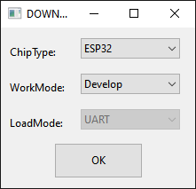
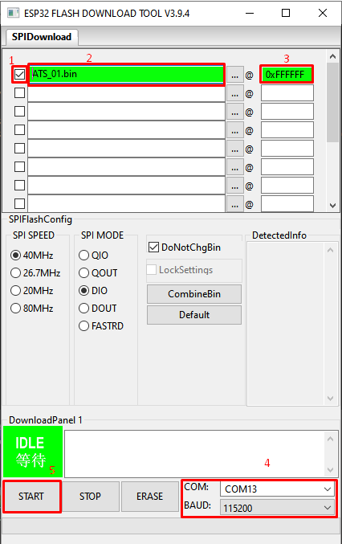

# Обновление firmware / spiffs

Для обновления firmware / spiffs испольуется ПО: flash_download_tool_3.9.4.exe

Запуск:

Настройка:

Для обновления необходимо сделать слледующие действия:

1. установить галочку
2. указать путь к файлу firmware/spiffs
3. указать адрес на flash памяти
4. выбрать COM порт
5. нажать кнопку START
